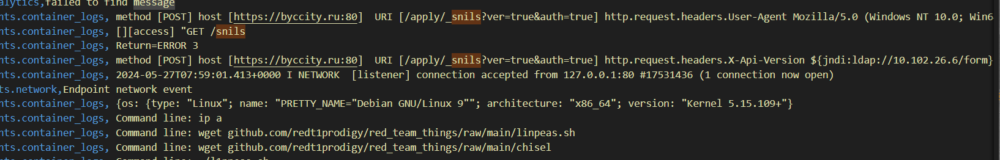
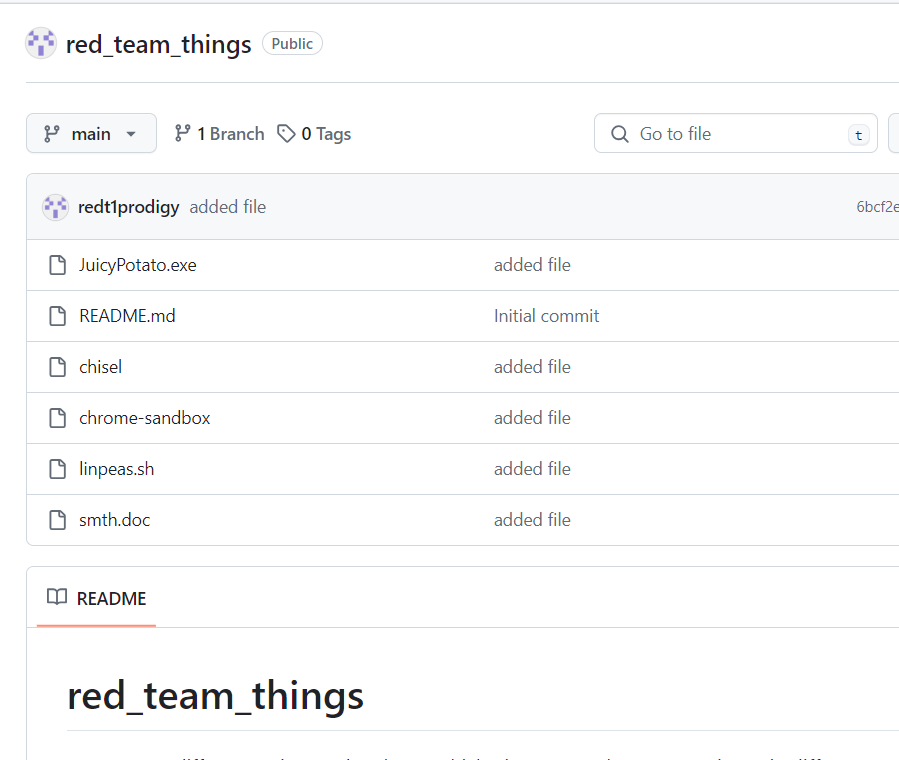
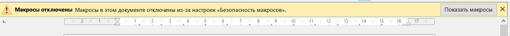
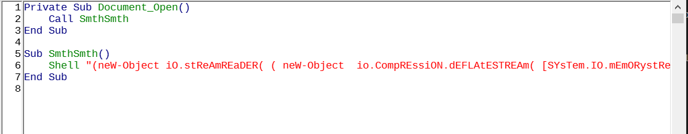

# Gos smth | Hard | Forensics

## Информация

> Ты проходишь собеседование на позицию специалиста SOC'а в гос компании после того, как нашел полезные знакомства на одном из фестивалей посвященных кибербезопасности.Теперь тебе предстоит рассмотреть файл с логами с SIEM'а. Изучить их, найди флаг и получи место в первой линии центра мониторинга безопасности.

## Выдать участинкам

.csv из диры [public/](public/)

## Описание

Найди флаг.

## Решение

В самом начале нам выдается файл .csv, который является распространенным расширением для хранения и обработки данных в SIEM'е. Видим что существуют три колонны, первая отвечает за timestamp, вторая за тип события и третья за логи события. Видим около тысячи разных логов. Начиная их изучать, решаем пройтись по api. Замечаем, что во многих кусках логов присутствует эксплуатация уязвимостей. Внимательно пройдя по разным строкам, замечаем это.

Кажется конкретно в этой ситуации у хакера удалось подключиться к серверу благодаря log4j, т.к. заголовок версии api оказался уязвимым. Также заметно, что пользователь загружает какие-то скрипты, для того, чтобы поднять привилегии. Тем не менее, помимо этого события есть еще много подобных с sql инъекциями. 

Но есть и разница, ведь в других атаках хакер скачивает тулкит с разных директорий авторов скриптов, но именно в этом событии, все скачивается с какого-то странного Гитхаба. Перейдем туда и посмотрим.

Тут оказываются еще какие-то файлы, которые не были загружены на наш сервер, но их все еще стоит посмотреть. Особенно привлекат smth.doc, т.к. он совпадает с названием таска. Открыв файл видим, что в нем содержатся макросы, стоит их изучить.

Видим какой-то макрос, который срабатывает при открытии файла. Также заметно, что там используется обфусцированный Powershell.

Попробуем декодировать и деобфусцировать его. К примеру, воспользовавшись PowerDecode.

Видим скачивание файла, который оказывается нашим флагом, ведь совпадает по своему формату.

## Флаг

goctf{g0_CTF_learN_ELK_stAck__}

